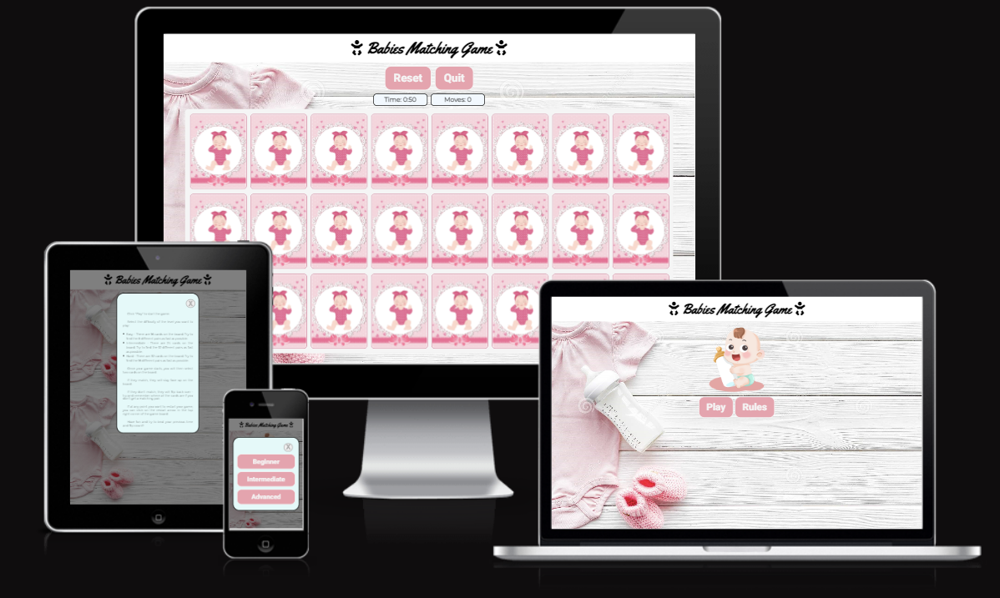

# Milestone Project 2 - Babies Matching Game

## Description

The babies matching game is an interactive game that can be played by all ages alone or in a group and fun way to test memory skills. The game has three different difficulty levels.

The concept of this interactive and didactic game is to test, challenge and improve the user memory skills. At start of the game all cards will be presented in the game area with back face turned up, hen the user will click on 2 cards of his choice, one after the other, to flip and reveal the front face, iif the front faces are matching, both cards will be kept revealed if not the cards will be hidden again, so on until all the cards are revealed or the game time is over.

This game was inspired by a game that I used to play when I was a kid and the theme is in honor of my baby daughter.

[View the live project here.](https://andrefarinha86.github.io/Babies-match-game/)

---

## User Experience (UX)

This project is designed for all users who like to have fun, play interactive games, test and exercise his memory skills. The game was thought and designed for 3 different difficulty levels, where the allowed playing time is reduced and the number of cards increases as the game level gets more difficult.

### Goals

#### *First Time users*

- As a first-time, the aim is for the user to easily navigate around the website intuitively, to have access to the tutorial information if needed,  and be able to easily understand the game rules.
- As a first-time, the aim is for the user to easily access the game area, to be able to choose the game's difficulty level before starting to play and to have an understanding of what will change at each difficulty level.
- As a first-time, the aim is for the user to have fun, test, challenge and improve the memory skills and gain a taste and interest in this type of didactic memory games.
- As a first-time, the aim is for the user to be able to keep track of the amount of flips it has taken to complete the game and the time taken to do so as this can give a personal challenge to beat it on any further play-throughs.

#### *Returning users*

- As a returning, the aim is for the user to stay motivated and keep playing to complete and win each game level in the shortest time and moves (flipped cards) as possible, improving the memory skills.

---

### Design

- The background was designed with neutral colors to avoid distractions and focus on the main content.

- Buttons were designed with hover style by changing the button backgroung and font color when user is over them.

- Modals were designed with whole background behind in dark color to allows the user to focus in Modal content.

- The title of the game has 2 Font Awesome baby icons at the beginning and end to emphasize the theme of the game.

- The predominant color of the website is pink due to the main theme of the game - Baby Girl

- Typography

    - For game title the 'Yellowtail' font was chosen with Sans Serif as the fallback font in case for any reason the font isn't being imported into the site correctly.
    - For all buttons the 'Heebo' font was chosen  with Sans Serif as the fallback font in case for any reason the font isn't being imported into the site correctly.
    - For text in general in whole website the 'montserrat' font was chosen with Sans Serif as the fallback font in case for any reason the font isn't being imported into the site correctly

 ---

### Wireframe

The Wireframe [balsamiq](https://balsamiq.com/) was used initially to draft and develop the website design in a responsive way:

1. Index - Game Home Page

2. Game level selection menu

3. Game tutorial and rules pop up

4. Game area for Beginner Level

5. Game area for Intermediate Level

6. Game area for Advanced Level

---

## Features

- The Babies Matching Game website project was designed to responsive respond to different screen sizes down to 280px wide .

1. **Header**

- Featured at the top of the page, the header shows the game name: Babies Matching Game in a different font and 2 icons included at beginning and the end.
- This header clearly tells the user what his is playing. 

2. **Home Page**

- The website has 2 pages, the home page that will launched once the website is loaded and the Game arae page that initial is hidden and will be launched once the user has choiced the desired level.

- The home page has a baby image to provide to the user an idea of website theme and 2 buttons (Play and Rules) that will pop up a modal with different information when the user click on it.

3. **Game Rules Modal**

- When the user clicks on the Rules button, a Modal will appear showing the rules of the game.

- The user can leave the modal and return to home page by clicking in the cross "X" button or simply by clicking outside of the modal area.

4. **Game Level choice Model**

- When the user clicks on the Play button, a Modal will appear showing 3 different buttons for each game level.

- Here the user can choose the desired game level, and when clicking on one of the buttons the game page will be launched with the selected game level.

- The user also can leave the modal and return to home page by clicking in the cross "X" button or simply by clicking outside of the modal area.

5. **Navigation Menu**

- In the game page has at top, right below the game title, 2 buttons (reset and quit)

- When clicking on the reset button, the user will restart the game returning to the default parameters, that is, all the revealed cards will be hidden again, the moves will be zeroed and the time will return to the initial time.

- By clicking on the quit button, the user returns to the home page, where he can check or review the game rules or choose another game level.

6. **Game Display**

- Betewen the navigation menu and the game board is located the game displey, where the user will be informed of the accumulated moves by turning over each card and the initial or remaining game time to end the game.

7. **Beginner Game board**

- When the user clicks and chooses the Beginner game level, a game page will open with 8 different cards pairs hidden and an allowed game time of 3 minutes.

- The user will be able to play by turning over one pair of cards at a time to see if the pair matches or not until all cars are revealed or game time is over.

8. **Intermediate Game board**

- When the user clicks and chooses the Beginner game level, a game page will open with 10 different cards pairs hidden and an allowed game time of 2 minutes.

- The user will be able to play by turning over one pair of cards at a time to see if the pair matches or not until all cars are revealed or game time is over.

9. **Advanced Game board**

- When the user clicks and chooses the Beginner game level, a game page will open with 12 different cards pairs hidden and an allowed game time of 1 minutes.

- The user will be able to play by turning over one pair of cards at a time to see if the pair matches or not until all cars are revealed or game time is over.

10. **Game over Modal**

- When the allowed playing time for each level is up before all the cards are revealed a modal will pop up informing the user that the the time has ran out and the game is over.

- The Game over Modal has Quit button that allows user to return to home page.

11. **Win Modal**

- When all the cards of each level are revealed before the time runs out, a modal will pop up congratulating the user and informing that the game is won.

- The Win Modal has Quit button that allows user to return to home page.

---

## Technologies Used

In this project the following technologies have been used.

### Languages Used

-   [HTML5](https://en.wikipedia.org/wiki/HTML5) used for basic content and structure of the website.
-   [CSS3](https://en.wikipedia.org/wiki/Cascading_Style_Sheets) used for style and design.
-   [JavaScript](https://en.wikipedia.org/wiki/JavaScript) used for logic structure of the game.

### Frameworks, Libraries & Programs Used

- [Google Fonts:](https://fonts.google.com/)
    - Google fonts were used to import the 'Yellowtail' font for Game title, 'Heebo' font for buttons and 'montserrat' font  for text in general into the style.css file which is used on all pages throughout the project.

- [Font Awesome:](https://fontawesome.com/)
    - Font Awesome was used on website title to add icons for aesthetic.

- [Hover.css:](https://ianlunn.github.io/Hover/)
    - Hover.css was used on the buttons to add the float transition while being hovered over.

- [Git](https://git-scm.com/)
    - Git was used for version control by utilizing the Gitpod terminal to commit to Git and Push to GitHub.

- [GitHub:](https://github.com/)
    - GitHub is used to store the projects code after being pushed from Git.

- [Balsamiq:](https://balsamiq.com/)
    - Balsamiq was used to create the wireframes during the design process.

- [Google Chrome Development Tools:](https://developer.chrome.com/docs/devtools/)
    - Google Chrome Development Tools was used for testing code on various device sizes during development and debugging.

---

## Testing

Along the development of the project regular testing were carried out. And the pages were reloaded several times after each addition and modification.

1. This website is responsive to all screens sizes down to 280px wide and was tested by using the devtools device toolbar for different devices.

2. The navigation buttons were tested and all work well.

3. Modals were tested and all work well and are responsive to different screen sizes.

4. All game leves were tested and all work well, cards are flipping, keep revealed if it matches and hide if it doesn't, moves are increasing with each flipped card and time is counting down. Gameover Modal is popping when time is finished before all cards are revealed and win modal is popping when all card are revealed before time is finished. When the reset button is clicked, moves will reset to zero, revealed cards will be hidden, and time will reset to initial.

### Validator Testing

5. The website code was both tested, manually and automatically (using the URL link) for HTML and CSS, through W3C Markup Validator and W3C CSS Validator Services, and  manually tested for JavaScript through JSHint which were used to validate the project and to ensure there were no syntax errors in the project.

- HTML
    - No errors were returned when passing through the official [W3C validator](https://validator.w3.org/) - [Results](https://validator.w3.org/nu/?doc=https%3A%2F%2Fandrefarinha86.github.io%2FBabies-match-game%2F)

- CSS
    - No errors were found when passing through the official [(Jigsaw) validator](https://jigsaw.w3.org/css-validator/#validate_by_input) - [Results](https://jigsaw.w3.org/css-validator/validator?uri=https%3A%2F%2Fandrefarinha86.github.io%2FBabies-match-game%2F&profile=css3svg&usermedium=all&warning=1&vextwarning=&lang=en)

- JavaScript
    - No errors were found when passing through the official [(JSHint) validator](https://jshint.com/) and the following metrics were returned:
        - There are 21 functions in this file.
        - Function with the largest signature take 2 arguments, while the median is 0.
        - Largest function has 13 statements in it, while the median is 4.
        - The most complex function has a cyclomatic complexity value of 5 while the median is 1.
        
        - 49 warnings
        
        - One unused variable

6. Lighthouse Testing - Accessibility 
 - The chosen colors and fonts were confirmed that are easy and accessible by running it through lighthouse in devtools.
    - Lighthouse Mobile

    

    The performance is not great on mobiles due to the format of the images used on the website.

    - Lighthouse Desktop

    

### Bugs

- Along the website development bugs were identified and resolved with assistance of Devtools.

- When the project was deployed to GitHub Pages I have noticed that images for the card front faces weren't loaded, the front faces being empty when cards flipped. With the help of my mentor and Devtools support we figured out that the error was that the file paths was incorrect:
"../assets/images" supposed to be "./assets/images"

### Unfixed Bugs

No unfixed bugs were found.

---

## Deployment

- The site was deployed to GitHub pages. The steps to deploy are as follows:
    - In the GitHub repository [here](https://github.com/AndreFarinha86/Alentejano-Wines), navigate to the Settings tab;
    - From the source section drop-down menu, select the Master Branch;
    - Once the master branch has been selected, the page will be automatically refreshed with a detailed ribbon display to indicate the successful deployment.

The live link can be found [here](https://github.com/AndreFarinha86/Babies-match-game)

---

## Credits

### Code

All code was cretead by the developer, guided and inspired by the [Love Maths](https://github.com/Code-Institute-Solutions/love-maths-2.0-sourcecode/tree/master/01-putting-the-basics-in-place/04-lets-get-stylish) from code Institute, [w3schools](https://www.w3schools.com/), [stackoverflow](https://stackoverflow.com/) and online divers pages and videos.

### Content and Media

All content and photos were used from the online sources such:
- [dreamstime](https://www.dreamstime.com/)
- [pexels](https://www.pexels.com/)
- [Google search engine](https://www.google.com/)

### Acknowledgements

- To my mentor, [Jack Wachira](https://github.com/iamjackwachira), for support me along the project, provide the required assistance and guide me in the right direction.
- The Slack community. All the help, support and information available from other students is really a great tool.

---

